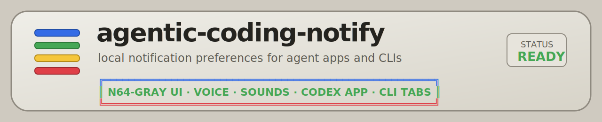
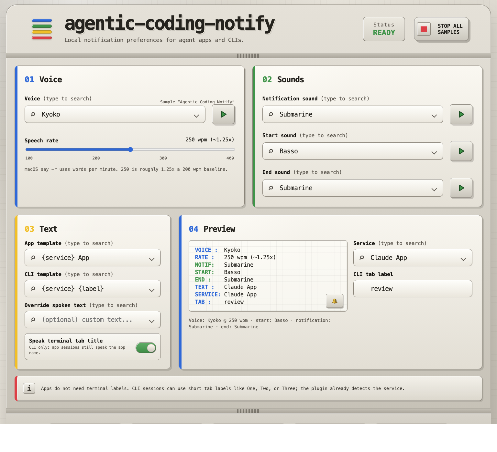

# agentic-coding-notify

<p align="center">
  
</p>

macOS notification preferences for local agent apps and CLIs.

This repo ships one shared notification layer with four entrypoints:

- **Claude Code** through the backwards-compatible `claude-code-notify` plugin.
- **Codex** through the `notify = [...]` hook in `~/.codex/config.toml`.
- **OpenCode** through a dedicated adapter script.
- **Pi** through a dedicated adapter script.

The repo name is `agentic-coding-notify`; the Claude plugin name intentionally remains `claude-code-notify` so existing Claude installs keep working.

## Quick start

Install the macOS notification dependency:

```bash
brew install terminal-notifier
```

Run the local preferences UI:

```bash
python3 web/notify_ui.py --open
```

Open `http://127.0.0.1:8765`, choose the voice/sounds/text templates, test samples, then save or export the config.

Install the adapter you use:

| Environment | Install path | Details |
|---|---|---|
| Claude Code | `claude plugin install claude-code-notify@agentic-coding-notify` | [docs/adapters.md#claude-code](docs/adapters.md#claude-code) |
| Codex | `bash adapters/codex/install.sh --print-config` | [docs/adapters.md#codex](docs/adapters.md#codex) |
| OpenCode | `bash adapters/opencode/install.sh` | [docs/adapters.md#opencode](docs/adapters.md#opencode) |
| Pi | `bash adapters/pi/install.sh` | [docs/adapters.md#pi](docs/adapters.md#pi) |

## What it does

When an adapter fires, you get:

1. a desktop notification via `terminal-notifier` when available;
2. a configurable notification sound;
3. an optional start sound;
4. a short spoken label using macOS `say`;
5. an optional end sound.

The spoken text is context-aware:

- app sessions can say just the app name, e.g. `Codex App`;
- CLI sessions can combine the service plus a short tab/profile label, e.g. `Codex One`;
- Codex App is detected explicitly and speaks as `Codex App`, not a truncated CLI label.

## Local preferences UI


<p align="center">
  
</p>

The local web UI is light-mode-only and uses a retro N64-gray console-panel style. It is self-contained: no external CSS, no external icon packs, and no remote assets.

It supports:

- searchable, scrollable comboboxes for voices, sounds, templates, and service names;
- type-to-filter fields that still show the full option list when focused;
- combobox show-off modes: cycle every option once, or enter `SHOW OFF SELECTION`, pick values, then cycle only those values once;
- an `×` clear control for show-off selections;
- one-button Play/Stop sample toggles for voice and every sound field;
- automatic sample playback when changing voice or sound selections;
- a standard voice sample phrase: `Agentic Coding Notify`;
- speech-rate tuning with `say -r` words per minute;
- a live preview for service, tab label, text, voice, and sounds;
- visible confirmation feedback for save, export, dry-run, notification, preset, sample, and show-off actions;
- hover/focus tooltips on each button and action;
- export of the current UI state to `agentic-coding-notify-config.json`;
- disclosure guidance for terminal labels;
- a CLI-only toggle to speak or omit the terminal tab title.

Preferences are saved to:

```text
~/.agentic-coding-notify/config.json
```

Default config:

```json
{
  "voice": "Zarvox",
  "rate": "250",
  "notification_sound": "Submarine",
  "start_sound": "Basso",
  "end_sound": "Submarine",
  "app_voice_text_template": "{service} App",
  "cli_voice_text_template": "{service} {label}",
  "voice_text_template": "",
  "speak_tab_title": "true"
}
```

Template placeholders:

| Placeholder | Meaning |
|---|---|
| `{service}` | `Claude`, `Codex`, `OpenCode`, or `Pi` |
| `{label}` | app label, terminal tab/profile name, or cwd fallback |
| `{voice_label}` | adapter-computed fallback spoken text |
| `{message}` | agent message preview used in tests/templates |
| `{context}` | `app` or `cli` |

More UI details: [docs/web-ui.md](docs/web-ui.md).

### Running and stopping the UI

Run in the foreground:

```bash
python3 web/notify_ui.py --host 127.0.0.1 --port 8765
```

Or run and open the browser automatically:

```bash
python3 web/notify_ui.py --open
```

Stop a foreground server with `Ctrl-C`. If a background server is listening on the default port:

```bash
lsof -tiTCP:8765 -sTCP:LISTEN | xargs kill
```

Check whether it is still running:

```bash
lsof -iTCP:8765 -sTCP:LISTEN -n -P
```

On this Mac the local Python UI process measured about 18 MB RSS while serving the page. Voice and sound option lists are cached after the first `/api/options` request to avoid repeated macOS scans.

## Repository layout

```text
.
├── .claude-plugin/          # Claude marketplace/plugin metadata
├── adapters/                # One adapter per host environment
│   ├── claude/
│   ├── codex/
│   ├── opencode/
│   └── pi/
├── docs/                    # User, adapter, and troubleshooting docs
├── hooks/                   # Backwards-compatible Claude hook shim
├── lib/                     # Shared config and audio helpers
├── tests/                   # Smoke/regression tests
└── web/                     # Local preferences UI
```

Ignored local workspace artifacts such as `.agents/`, `.claude/`, `skills-lock.json`, logs, and old debug notes are not part of the shipped plugin.

## Development

Run the full smoke suite:

```bash
./tests/plugin_smoke_test.sh
```

Run only the Codex adapter regression suite:

```bash
./tests/codex_notify_test.sh
```

Validate the Claude plugin manifest:

```bash
claude plugin validate .
```

Static checks used for this repo:

```bash
python3 -m py_compile web/notify_ui.py
python3 -m json.tool .claude-plugin/plugin.json >/dev/null
python3 -m json.tool .claude-plugin/marketplace.json >/dev/null
git diff --check
```

## Troubleshooting

See [docs/troubleshooting.md](docs/troubleshooting.md) for common issues, including:

- Claude Desktop sandbox behavior and why `terminal-notifier` is preferred;
- Codex `notify` limitations;
- generic Codex labels;
- the local web UI port already being in use.

## License

MIT — see [LICENSE](LICENSE).
